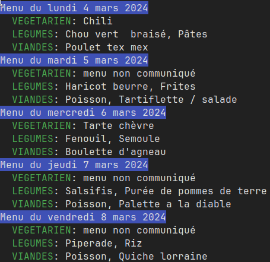

# Crous

Un programme en ligne de commande simple qui récupère les menus de restaurants Crous.



# Utilisation

```
Utilisation: crous [OPTIONS] [RESTAURANTS]...

Arguments:
  [RESTAURANTS]...  Restaurants à afficher le menu. Les noms sont ceux inscrit comme alias dans la config. Si aucun restaurants n'est renseigné, le menu affiché sera celui du champ "default" de la config.

Options:
  -d, --days <DAYS>  Nombre de jours à afficher [default: 1]
  -a, --all          Si il faut afficher le menu de  tous les restaurants de la config au lieu de ceux choisis en arguments
  -l, --list         Affiche les restaurants enregistrés dans la config
```

# Configuration

Le nom des restaurants (en arguments) sont définie dans le fichier de configuration `~/.config/crous/crous.toml` avec le format suivant:

```toml
default = "haut-carre"
[aliases]
    haut-carre = "https://www.crous-bordeaux.fr/restaurant/restaurant-administratif-le-haut-carre-3/"
    ru2 = "https://www.crous-bordeaux.fr/restaurant/resto-u-n2/"
```


# Installation

- Installer rust et cargo (https://rustup.rs/)
- Cloner le dépôt
- `cd crous`
- Compiler avec `cargo build --release` (le binaire est dans `target/release/`
- Optionnel: Installer avec `cargo install --path .`

